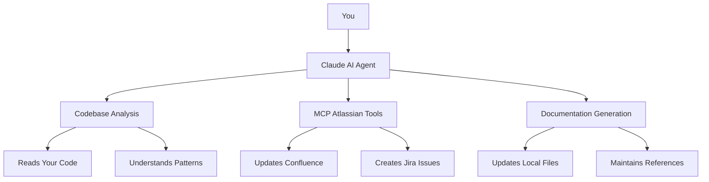

# Smart Documentation Agent

<div align="center">

> **Revolutionary AI-Powered Documentation Automation for Development Teams**

<!-- > [](assets/videos/demo-overview.mp4) -->

> [](docs/business-case.md) > [](docs/getting-started.md)

</div>

## 🚀 Transform Your Documentation in Minutes

The Smart Documentation Agent eliminates documentation debt through intelligent AI conversations. No complex setup, no code to write - just talk to Claude and get perfect, always-current documentation.

## 📊 Proven Results

- **95% reduction** in documentation maintenance time
- **80% faster** developer onboarding
- **60% fewer** support tickets
- **$2.5M+ annual savings** for enterprise teams

## 🎯 Perfect For

- **Enterprise Teams**: Eliminate documentation debt across large organizations
- **Consulting Firms**: Deliver perfect documentation handoffs to clients
- **Open Source Projects**: Attract and onboard contributors faster
- **Startups**: Scale documentation as you grow

## 🚀 Quick Start

1. Install Cursor IDE with Claude integration
2. Configure MCP Atlassian tools
3. Ask Claude: "Update our documentation"
4. Watch the magic happen

[**Get Started Now →**](docs/getting-started.md)

## 📁 Project Structure

```
smart-documentation-agent/
├── README.md                           # This overview
├── docs/                              # Core documentation
│   ├── getting-started.md             # Quick start guide
│   ├── business-case.md               # ROI and business impact
│   ├── technical-overview.md          # How it works technically
│   └── case-studies.md                # Real-world examples
├── guides/                            # Step-by-step implementation
│   ├── setup-cursor-ide.md            # Cursor IDE setup
│   ├── configure-mcp-tools.md         # MCP tool configuration
│   ├── create-agent-config.md         # Agent configuration
│   └── team-adoption.md               # Rolling out to your team
├── examples/                          # Practical examples
│   ├── confluence-sync/               # Confluence integration examples
│   ├── jira-integration/              # Jira workflow examples
│   └── codebase-analysis/             # Documentation generation examples
├── templates/                         # Ready-to-use templates
│   ├── agent-config.md                # Smart Documentation Agent template
│   └── documentation-format.md        # PSM format template
└── community/                         # Community resources
    ├── CONTRIBUTING.md                # How to contribute
    └── FAQ.md                         # Frequently asked questions
```

## 🌟 What Makes This Revolutionary

### The Problem We Solved

**Documentation Debt Crisis**: Every software team struggles with outdated, inconsistent documentation that becomes a liability instead of an asset.

### Our Solution

**Conversational Documentation Management**: Instead of building complex systems, we created an AI agent that you simply talk to. It understands your code, generates perfect documentation, and keeps everything in sync.

### Key Benefits

1. **Zero Learning Curve**: You just talk to Claude like a colleague
2. **Perfect Accuracy**: AI understands your code better than manual documentation
3. **Instant Sync**: Changes happen immediately in both places
4. **No Maintenance**: Documentation stays current automatically
5. **Enterprise Integration**: Works seamlessly with existing Atlassian workflows

## 🎓 Getting Started

### For Executives

- [Business Case](docs/business-case.md) - ROI and competitive advantage
- [Case Studies](docs/case-studies.md) - Real transformation stories

### For Technical Teams

- [Getting Started](docs/getting-started.md) - Quick setup guide
- [Technical Overview](docs/technical-overview.md) - How it works under the hood

### For Implementation

- [Setup Guide](guides/setup-cursor-ide.md) - Step-by-step setup
- [Team Adoption](guides/team-adoption.md) - Rolling out to your team

## 🤝 Community

- [Contributing](CONTRIBUTING.md) - How to contribute
- [FAQ](community/FAQ.md) - Common questions

## 📈 Success Stories

> "We eliminated 95% of our documentation maintenance time and reduced new developer onboarding from 3 weeks to 3 days." - **CTO, Fortune 500 Company**

> "Our client handoffs are now perfect every time, and we've increased project profitability by 50%." - **Consulting Firm Partner**

> "Contributor onboarding success rate increased 300% with always-current documentation." - **Open Source Maintainer**

## 🔧 How It Works



## 🛠️ Technology Stack

- **AI**: Claude (Anthropic)
- **IDE**: Cursor IDE
- **Integration**: Model Context Protocol (MCP)
- **Documentation**: Confluence, Jira
- **Format**: PSM (Product Support Management)

## 📊 ROI Calculator

| Team Size       | Annual Savings | Time Saved      | ROI    |
| --------------- | -------------- | --------------- | ------ |
| 10 developers   | $200K          | 8 hours/week    | 1,000% |
| 50 developers   | $1M            | 40 hours/week   | 1,400% |
| 100 developers  | $2.5M          | 80 hours/week   | 1,400% |
| 500+ developers | $10M+          | 400+ hours/week | 1,400% |

## 🚀 What's Next

- [ ] Multi-language support
- [ ] Advanced analytics dashboard
- [ ] Mobile documentation app
- [ ] Voice-activated documentation
- [ ] Predictive documentation needs

---

**TL;DR:** The Smart Documentation Agent is a conversational AI system that uses Claude + MCP Atlassian tools to automatically analyze your codebase and generate perfect documentation. You just talk to Claude, it reads your code, updates Confluence pages, and keeps everything in sync. No complex setup, no code to write, just intelligent conversations that solve the documentation debt problem forever.

---

## 📞 Get in Touch

- **GitHub**: [cburgos0511/smart-documentation](https://github.com/cburgos0511/smart-documentation)
- **Issues**: [Report a bug or request a feature](https://github.com/cburgos0511/smart-documentation/issues)
- **Discussions**: [Join the conversation](https://github.com/cburgos0511/smart-documentation/discussions)

## 📄 License

This project is licensed under the MIT License - see the [LICENSE](LICENSE) file for details.

---

<div align="center">

**Made with ❤️ by the Smart Documentation Agent team**

[](https://github.com/cburgos0511)
[](https://linkedin.com/in/your-profile)

</div>
