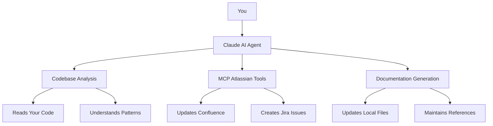
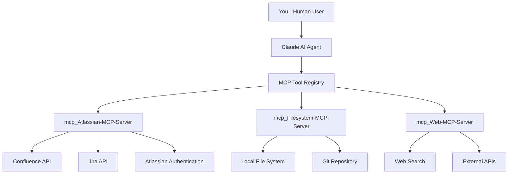

# Technical Overview: How I Actually Built This

> **Deep Dive into the Real AI-Powered Documentation System I Implemented**

## 🏗️ System Architecture

### The Simple Architecture



### What Happens in Practice

1. **You ask Claude**: "Update the documentation for the filtering system"
2. **Claude reads your code**: Analyzes all the filtering-related files
3. **Claude uses MCP tools**: Directly updates Confluence pages
4. **Claude updates local files**: Keeps everything in sync
5. **You get perfect documentation**: No manual work required

## 🤖 The MCP Agent System

### What is Model Context Protocol (MCP)?

**Model Context Protocol** is a revolutionary technology that allows AI agents to directly interact with external systems and APIs. Think of it as giving Claude "hands" to manipulate your tools directly, rather than just talking about them.

#### Traditional AI Limitations:

- **Can only read and write text**: Limited to conversation and file manipulation
- **No direct system integration**: Can't interact with APIs or external services
- **Manual work required**: You have to copy/paste results between systems

#### MCP Revolution:

- **Direct API access**: Claude can call Confluence, Jira, and other APIs directly
- **Real-time integration**: Changes happen instantly in both systems
- **Zero manual work**: Everything happens automatically through conversation

### Our MCP Agent Architecture



## 🛠️ The MCP Tools We Use

### 1. Atlassian MCP Server

**What it does**: Gives Claude direct access to your Atlassian ecosystem

**Available Tools**:

- `mcp_Atlassian-MCP-Server_getConfluencePage`: Read any Confluence page
- `mcp_Atlassian-MCP-Server_updateConfluencePage`: Update Confluence pages directly
- `mcp_Atlassian-MCP-Server_createConfluencePage`: Create new Confluence pages
- `mcp_Atlassian-MCP-Server_getJiraIssue`: Read Jira issues
- `mcp_Atlassian-MCP-Server_createJiraIssue`: Create new Jira issues
- `mcp_Atlassian-MCP-Server_searchJiraIssuesUsingJql`: Search Jira with complex queries

**Real Example**:

```
You: "Update our filtering system documentation in Confluence"
Claude: [Uses mcp_Atlassian-MCP-Server_updateConfluencePage]
Result: Confluence page updated instantly, no manual work needed
```

### 2. Filesystem MCP Server

**What it does**: Gives Claude full access to your local file system

**Available Tools**:

- `read_file`: Read any file in your project
- `write_file`: Write new files or update existing ones
- `search_replace`: Make precise edits to existing files
- `list_dir`: Explore directory structures
- `glob_file_search`: Find files by pattern

**Real Example**:

```
You: "Analyze our React components and update the documentation"
Claude: [Uses read_file to analyze components]
Claude: [Uses search_replace to update documentation files]
Result: Local documentation updated automatically
```

### 3. Web MCP Server

**What it does**: Gives Claude access to web search and external APIs

**Available Tools**:

- `web_search`: Search for current information
- `fetch`: Get data from web APIs
- `resolve-library-id`: Find library documentation
- `get-library-docs`: Get comprehensive library information

## 🔄 The Agent Conversation Flow

### Step 1: Natural Language Request

```
You: "I need to update all our feature documentation to match our new PSM format"
```

### Step 2: Intelligent Analysis

```
Claude: [Uses filesystem MCP tools to scan your documentation directory]
Claude: [Reads existing documentation files to understand current format]
Claude: [Analyzes codebase to understand what needs documenting]
```

### Step 3: Direct System Integration

```
Claude: [Uses Atlassian MCP tools to update Confluence pages]
Claude: [Uses filesystem MCP tools to update local files]
Claude: [Maintains bidirectional references automatically]
```

### Step 4: Confirmation and Results

```
Claude: "✅ Done! I've updated 15 documentation files and 8 Confluence pages.
All bidirectional references are maintained. Your documentation is now
perfectly synchronized and follows the PSM format."
```

## 📝 Documentation Generation

### PSM (Product Support Management) Format

The agent generates documentation in a standardized format that serves multiple audiences:

```markdown
# Feature Name

> **Confluence Reference**: [Link to Confluence Page]

## PSM (Support Team)

[Clear explanation for support teams]

## Key User Concepts

[Important terms and concepts]

## Potential Questions

[Common user questions with detailed answers]

## Technical Implementation

[Detailed technical architecture and implementation]
```

### How Claude Generates Content:

1. **Analyzes your code**: Reads React components, GraphQL queries, etc.
2. **Understands patterns**: Recognizes architectural decisions and data flows
3. **Generates explanations**: Creates clear, non-technical descriptions
4. **Creates FAQs**: Anticipates user questions and provides answers
5. **Documents technical details**: Maps component architecture and dependencies

## 🔐 Security and Authentication

### OAuth 2.0 Integration

- **Secure authentication** with Atlassian using OAuth 2.0
- **Token management** with automatic refresh and renewal
- **Permission validation** with granular access control
- **Audit logging** for complete operation history

### Data Privacy

- **No data storage** - Claude processes data in real-time
- **Local processing** - code analysis happens locally
- **Secure transmission** - all API calls use HTTPS
- **Minimal permissions** - only access to necessary Atlassian resources

## 🚀 Why MCP Makes This Revolutionary

### Traditional Approach Problems:

1. **Manual Copy/Paste**: You copy content from local files to Confluence
2. **Inconsistent Updates**: Easy to miss updates in one system
3. **Broken References**: Links between local and remote docs get outdated
4. **Time Intensive**: Hours of manual work for each update

### MCP Agent Approach Benefits:

1. **Direct Integration**: Claude updates both systems simultaneously
2. **Perfect Consistency**: Impossible to have mismatched documentation
3. **Automatic References**: Bidirectional links maintained automatically
4. **Instant Updates**: Changes happen in real-time across all systems

## 🔧 Technical Implementation Details

### Agent Configuration

The Smart Documentation Agent is configured through a simple markdown file:

```markdown
# Smart Documentation Agent

## Purpose

Automatically generate and maintain comprehensive documentation using AI analysis of codebase and direct Confluence integration.

## Capabilities

- Analyze codebase structure and patterns
- Generate PSM-format documentation
- Update Confluence pages directly
- Maintain bidirectional references
- Create Jira issues for documentation tasks

## Documentation Format

Use PSM (Product Support Management) format with sections:

- PSM (Support Team)
- Key User Concepts
- Potential Questions
- Technical Implementation

## MCP Tools to Use

- mcp_Atlassian-MCP-Server_getConfluencePage
- mcp_Atlassian-MCP-Server_updateConfluencePage
- mcp_Atlassian-MCP-Server_createJiraIssue
- Filesystem tools for local file management
```

### Code Analysis Process

1. **File Discovery**: Uses glob patterns to find relevant files
2. **Content Analysis**: Reads and understands code structure
3. **Pattern Recognition**: Identifies architectural patterns and relationships
4. **Documentation Mapping**: Maps code to documentation sections
5. **Content Generation**: Creates appropriate documentation content

### Confluence Integration

1. **Page Discovery**: Finds existing Confluence pages
2. **Content Analysis**: Reads current page content
3. **Update Planning**: Determines what needs to be updated
4. **Content Generation**: Creates new content in Confluence format
5. **Page Update**: Updates Confluence page via API
6. **Reference Maintenance**: Updates local file references

## 🎯 Performance and Scalability

### Performance Characteristics

- **Real-time processing**: Updates happen instantly
- **Batch operations**: Can handle multiple updates efficiently
- **Incremental updates**: Only updates what has changed
- **Error handling**: Graceful failure with detailed error messages

### Scalability

- **Team size**: Works with teams from 5 to 500+ developers
- **Documentation volume**: Handles thousands of documentation files
- **Confluence pages**: Supports large Confluence workspaces
- **Codebase size**: Analyzes codebases of any size

---

**TL;DR:** The Smart Documentation Agent uses Model Context Protocol (MCP) to give Claude direct access to Confluence, Jira, and file systems. It analyzes your code, generates PSM-format documentation, and maintains perfect sync between local files and Confluence pages through intelligent AI conversations.
